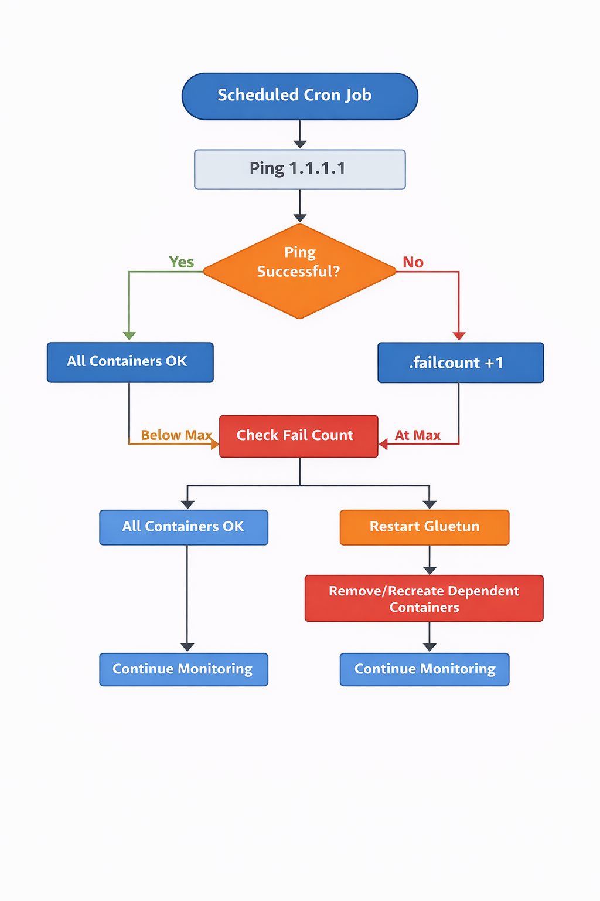

# Gluetun Watchdog Script Documentation

## Overview

The **Gluetun Watchdog Script** monitors your Gluetun VPN container and ensures that all dependent Docker containers maintain connectivity through the VPN. If the VPN becomes unreachable, the script automatically stops and starts the Gluetun container and reinitializes all dependent containers, preventing network failures in applications like qBittorrent, Sonarr, Radarr, and Plex.

- Tested on QNAP TVS-h1288X, firmware QuTS hero h5.2.8.3359.  
- Uses a ping check to verify internet connectivity through the VPN.  
- Configurable dependent containers and paths.  

---

## How It Works

1. **Ping Test**  
   The script periodically pings a reliable IP (default `1.1.1.1`) from within the Gluetun container. If the ping succeeds, the VPN is considered active.

2. **Fail Count and `.failcount` State File**  
   If the ping fails, a **fail count** is incremented. This fail count is stored in the `.failcount` **state file**, so the script remembers consecutive failures even across multiple runs (e.g., via cron). Only after a configurable number of consecutive failures (default 10) does the script take action to restart the VPN and dependent containers.  
   - If the ping succeeds, the fail count is reset to 0.  
   - If the fail count reaches the maximum threshold, the recovery sequence is triggered.

3. **Restart Sequence**  
   Once the fail threshold is reached:
   - The Gluetun container is **stopped and started** to re-establish the VPN connection.
   - The script waits a configurable number of seconds to allow the VPN to initialize (`SLEEP_AFTER_START`).
   - All dependent containers are **removed** using `remove_gluetun_containers.sh` and **recreated** using `recreate_gluetun_containers.sh`.

4. **Dependent Containers**  
   - The dependent containers are listed in a file, default name: `gluetun_containers`.  
   - **This file is configurable** and can be renamed to any filename of your choice. Its path can be set in the `gluetun_watchdog.env` environment file using `GLUETUN_CONTAINER_FILE`.  
   - Each folder corresponds to a Docker project directory inside `DOCKER_DIR`.
   - The `recreate_gluetun_containers.sh` script assumes each dependent folder contains a `docker-compose.sh` script.  
     - This script **creates a single `docker-compose.yml`** from one or more YAML files and runs `docker compose up -d`.  
     - This setup is specifically designed for **QNAP NAS and Container Station**, which may require a single combined YAML file per project to start multiple services reliably.  

---

## Why Absolute Paths and `add_to_path` are Necessary

- All paths to scripts, log files, and container folders should be **absolute paths** because cron runs scripts in a minimal environment with no guarantee of a working directory.  
- The `add_to_path` function ensures that commands like `docker`, `cat`, `grep`, `ping`, `date`, and `sleep` can be found by cron. Without it, the script may fail because cron cannot locate these binaries in its limited PATH.

Example in the watchdog script:

```bash
add_to_path() {
  cmd="$1"
  dir=$(dirname "$(command -v "$cmd" 2>/dev/null || echo '')")
  if [ -n "$dir" ] && [[ ":$PATH:" != *":$dir:"* ]]; then
    PATH="$dir:$PATH"
  fi
}

for cmd in docker ping cat grep sleep date; do
  add_to_path "$cmd"
done
```

## Docker Compose Script Examples

The docker-compose.sh script in each dependent folder can vary depending on how the Docker container is defined:
Each dependent folder listed in `gluetun_containers` must have a `docker-compose.sh` file. This script can vary depending on how the Docker container is defined:

1. Multiple YAML files concatenated with a pipe (typical QNAP setup):

```bash
cat ../common/volumes.yml \
  volume-config.yml \
  ../common/volumes_movies.yml \
  ../common/volumes_downloads_deluge.yml \
  ../common/volumes_downloads_sabnzbd.yml \
  radarr.yml > docker-compose.yml | docker compose up -d
```

2. Single YAML file containing the complete setup:

```bash
cat radarr.yml > docker-compose.yml | docker compose up -d
```

3. Directly using docker compose up if the folder already contains a `docker-compose.yml` or `docker-compose.yaml`:

```bash
docker compose up -d
```

4. Specify a single YAML file with -f:

```bash
docker compose -f radarr.yml up -d
```

**Important:** The folder must contain a file named `docker-compose.sh`, because the `recreate_gluetun_containers.sh` script calls this script to recreate the container.

The setup with multiple YAML files is required for running on QNAP Container Station, which does not always support multiple Compose files natively.

The `gluetun_containers` file is configurable and can be renamed; its path is set in `gluetun_watchdog.env`.

## Scripts Overview

### remove_gluetun_containers.sh

- Reads the list of dependent container folders from `gluetun_containers` (or your configured file).
- Iterates through each folder, lists all running containers via `docker compose ps`, and removes them (`docker rm -f`).
- Ensures all containers relying on Gluetun are stopped before the VPN is restarted.

### recreate_gluetun_containers.sh

Reads the list of dependent container folders from gluetun_containers (or your configured file).

- Executes the `docker-compose.sh` script in each folder.
- Each `docker-compose.sh` creates a `docker-compose.yml` and runs `docker compose up -d`.
- This ensures compatibility with QNAP Container Station.

## Environment File

All paths, container names, and settings are loaded from a `.env` file (`gluetun_watchdog.env`).
This allows easy configuration of paths, container names, and other parameters without modifying the scripts themselves.
All paths **must be absolute**, and the `add_to_path` function ensures commands are available when run via cron.

### Example `gluetun_watchdog.env`

```bash
LOGFILE="/share/homes/<user>/scripts/gluetun_watchdog/logs/gluetun_watchdog.log"
STATEFILE="/share/homes/<user>/scripts/gluetun_watchdog/.failcount"
DOCKER_DIR="/share/homes/<user>/docker"
GLUETUN_CONTAINER_FILE="/share/homes/<user>/scripts/gluetun_watchdog/gluetun_containers"
DOCKER_COMPOSE_SCRIPT="docker-compose.sh"

GLUETUN_CONTAINER="gluetun"
REMOVE_SCRIPT="/share/homes/<user>/scripts/gluetun_watchdog/remove_gluetun_containers.sh"
RECREATE_SCRIPT="/share/homes/<user>/scripts/gluetun_watchdog/recreate_gluetun_containers.sh"

PING_TARGET="1.1.1.1"
PING_COUNT=2

MAX_FAILURES=10
SLEEP_AFTER_START=30
```

## Cron Setup on QNAP

**Important:** On QNAP NAS, do not use `crontab -e`. Edit the cron file directly.

Edit `/etc/config/crontab` directly and add:

```bash
*/10 * * * * /bin/bash /share/homes/<user>/scripts/gluetun_watchdog/gluetun_watchdog.sh
```
Make sure the path to `gluetun_watchdog.sh` is absolute.

Reload cron:

```bash
crontab /etc/config/crontab && /etc/init.d/crond.sh restart
```

_Reference:_ [QNAP Wiki: Add items to crontab](https://wiki.qnap.com/wiki/Add_items_to_crontab).

## Logging

All actions and outputs are logged to the file specified in LOGFILE.

```bash
2026-02-10 20:00:00 - Gluetun VPN check failed (3/10). Current fail count: 3, Max allowed failures: 10.
2026-02-10 20:00:00 - Failure threshold reached. Stopping Gluetun container...
2026-02-10 20:00:01 - Starting Gluetun container...
2026-02-10 20:00:31 - ===== BEGIN remove_gluetun_containers.sh =====
...
2026-02-10 20:00:32 - ===== END recreate_gluetun_containers.sh =====
2026-02-10 20:00:32 - Gluetun recovery sequence finished.
```

## Watchdog Flow Diagram


*Note: The diagram illustrates the flow from scheduled cron execution, ping check, fail count, container stop/start, and dependent container recreation.*
